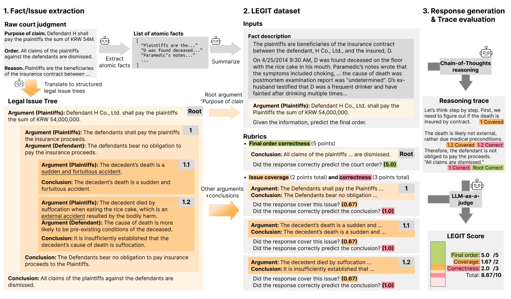

# LEGIT

**Evaluating Legal Reasoning Traces with Legal Issue Trees**

Jinu Lee, Kyoung-Woon On, Simeng Han, Arman Cohan, Julia Hockenmaier

> Evaluating the quality of LLM-generated reasoning traces in expert domains (e.g.,, law) is essential for ensuring credibility and explainability, yet remains challenging due to the inherent complexity of such reasoning tasks. We introduce LEGIT (LEGal Issue Trees), a novel large-scale (24K instances) expert-level legal reasoning dataset with an emphasis on reasoning trace evaluation. We convert court judgments into hierarchical trees of opposing parties' arguments and the court's conclusions, which serve as rubrics for evaluating the issue coverage and correctness of the reasoning traces. We verify the reliability of these rubrics via human expert annotations and comparison with coarse, less informative rubrics. Using the LEGIT dataset, we show that (1) LLMs' legal reasoning ability is seriously affected by both legal issue coverage and correctness, and that (2) retrieval-augmented generation (RAG) and RL with rubrics bring complementary benefits for legal reasoning abilities, where RAG improves overall reasoning capability, whereas RL improves correctness albeit with reduced coverage.



# Installation

Install python requirements by:

```sh
virtualenv .venv
source .venv/bin/activate # create and activate venv
pip install -r requirements.txt # install python dependencies
```

# Main Experiments

LEGIT currently supports `vllm`, `ollama`, `vertexai` (Gemini), and `openai` (OpenAI GPT/oN) for LLM generation.
If you need to add different frameworks to test your own LLM, write your own `async def generate()` function in `utils/package` and add appropriate initialization script in `utils/router.py`.

## Generating responses

Execute this script:
```sh
# PACKAGE: vllm -> MODEL: huggingface ID for `load_from_pretrained` function (e.g., Qwen/Qwen2.5-3B-Instruct, ./my_models/checkpoints/step_500)
# PACKAGE: ollama -> MODEL: ollama ID (e.g., llama3.1)
# PACKAGE: vertexai -> MODEL: vertexai model ID (e.g., gemini-2.0-flash)
# PACKAGE: openai -> MODEL: openai model ID (e.g., gpt-4.1, o3)
python reasoning_task_solve.py --package {PACKAGE} --model {MODEL}
# This will generate `results/reasoning_tasks_{MODEL}.jsonl` file.
```

## Evaluating responses

Execute this script:
```sh
# RESPONSE_FILE: results/reasoning_tasks_{GENERATOR_MODEL}.jsonl
python reasoning_task_solve.py --package {PACKAGE} --model {MODEL} --response_path {RESPONSE_FILE}
# This will generate `results/reasoning_tasks_{GENERATOR_MODEL}_evaluator_{MODEL}/.jsonl` file.
```

# Additional experiments

## Evaluating with RAG

### Overview

First, we run batch retrieval using the scripts below. These will use the test data (data/reasoning_tasks_test.jsonl) and add retrieval results.
Retrieval base can be found from `data/deduplicated_relevant_laws.json`.

```sh
python lawretrieval_baseline_{RETRIEVAL_METHOD}.py
# This will generate `data/lawretrieval_test_{RETRIEVAL_METHOD}.jsonl
```

Finally, generate the response with following script. Evaluate the generated data with the evaluation script above.
```sh
# RETRIEVAL_METHOD: bm25, contriever, groundtruth
python reasoning_task_solve_rag.py --package {PACKAGE} --model {MODEL} --retrieval_method {RETRIEVAL_METHOD}
# This will generate `results/reasoning_tasks_rag_{RETRIEVAL_METHOD}_{MODEL}.jsonl` file.
```

## Training your LLM with `verl` on LEGIT training set

First, install custom `verl` (branched from 0.5.0 to accomodate Gemma 3):
```sh
cd verl
pip install -e .
cd ..
```

Next, download the verl training data using this script:
```sh
python utils/verl/download_legit_data.py
```

Finally, execute verl training via command line interface. We provided the configuration used for the paper in `verl_trainer_example.sh`.
If you open the script file, there will be (1) a commented line that starts the vLLM server for LLM-as-a-judge, and (2) 2 instances of CUDA_VISIBLE_DEVICES. Modify it as necessary.